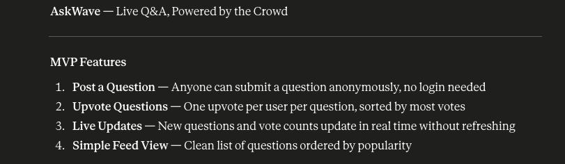

# AskWave — Live Q&A, Powered by the Crowd

## MVP Features

1. **Post a Question** — anyone can submit a question anonymously, no login needed.
2. **Upvote Questions** — one upvote per user per question, sorted by most votes.
3. **Live Updates** — new questions and vote counts update in real time without refreshing.
4. **Simple Feed View** — clean list of questions ordered by popularity.

**Tools:** Next.js + Supabase.

---

## Resources

**Claude Web** — got the idea and the basic feature list.

**Claude Code** — planning, scaffolding, CI/CD, feature implementation.

**Supabase MCP** — project + schema access from CLI.

---

## Sessions

### Session 01 — 2026-05-11

- Wrote `IMPLEMENTATION.md` (stack, anon-auth strategy, schema, RLS, realtime model, file layout, build order).
- Added architecture conventions to the plan: no inline styles, divide-and-conquer, side effects in hooks.
- Initialized git, renamed folder to `AskWave`, created public GitHub repo `hammadsheikh07/AskWave`.
- Scaffolded Next.js 15 + Tailwind v4 + Supabase boilerplate (no feature code).
- Added Claude auto-review GitHub Actions workflow (`.github/workflows/claude-review.yml`).
- Wrote `README.md`.
